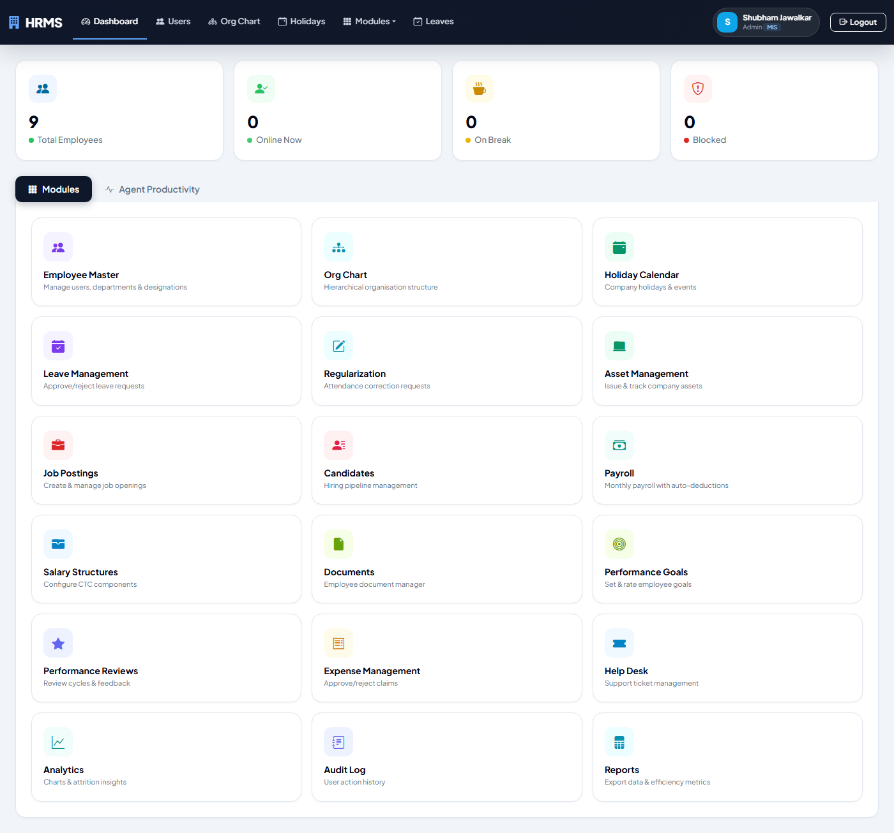
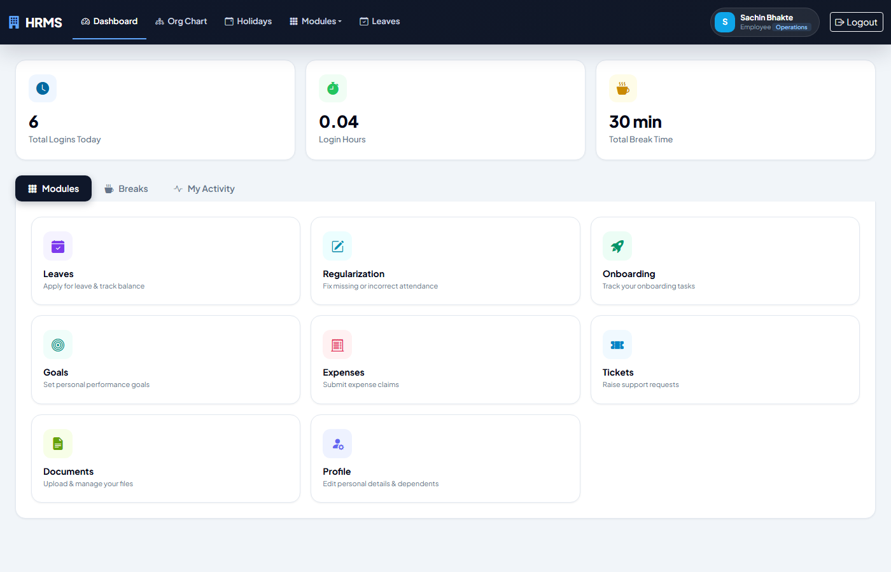
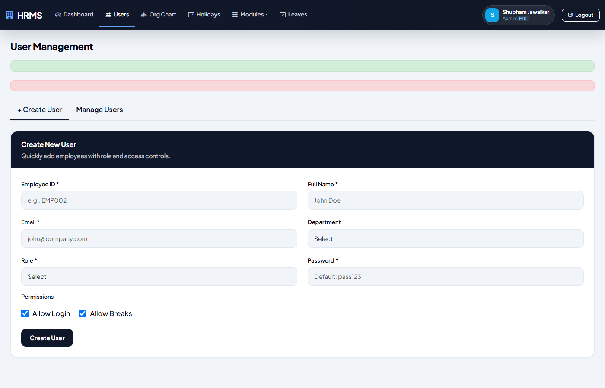
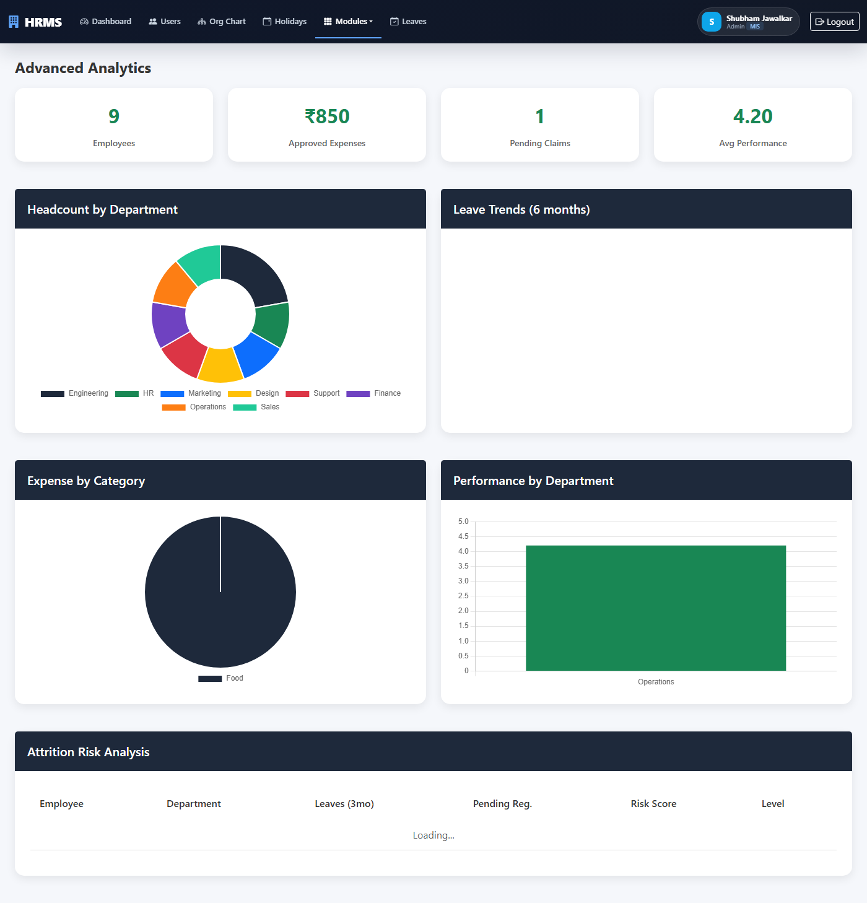
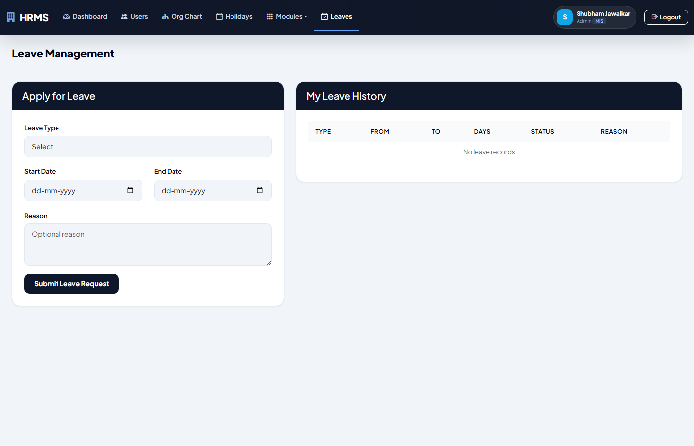
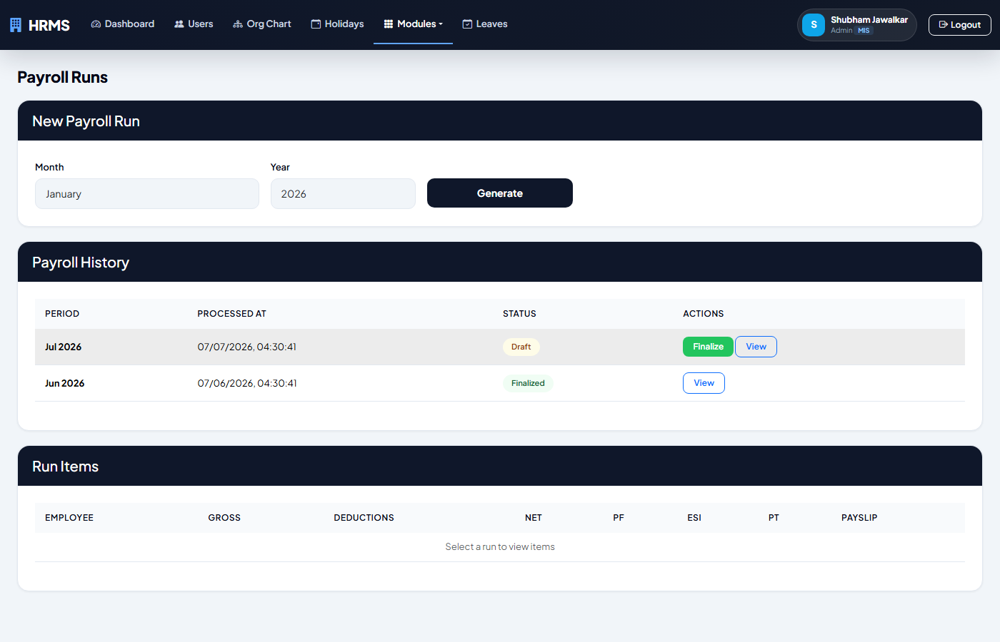
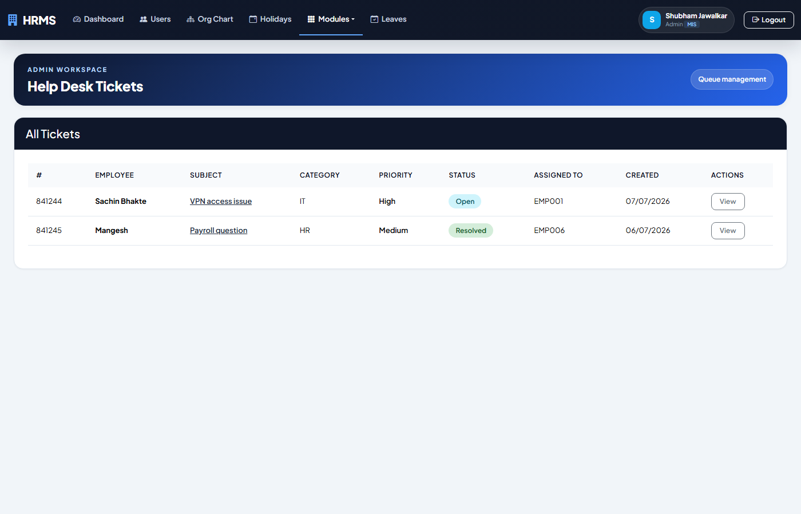

# HRMS-Portal

A modern Flask-based Human Resource Management System designed for managing employees, leaves, payroll, recruitment, assets, tickets, goals, onboarding, and more from a single portal.

## Overview

HRMS-Portal is a role-based HR application that helps organizations manage day-to-day employee operations with an intuitive web interface. It includes separate experiences for admins and employees, along with a central dashboard for reporting and administration.

## Key Features

- Employee authentication and role-based access
- Admin and employee dashboards
- Employee profile management
- Leave requests and leave tracking
- Holidays and regularization workflows
- Payroll and salary management
- Recruitment modules for jobs, candidates, interviews, and offers
- Onboarding and offboarding tasks
- Assets management
- Tickets and support workflows
- Analytics and reporting views
- REST-style APIs with Swagger documentation

## Project Screenshots

### Home Page


### Admin Dashboard


### User Dashboard


### Employee Management


### Analytics & Reports


### Leaves & Requests


### Payroll


### Ticketing


## Tech Stack

- Python 3.10+
- Flask
- DuckDB
- Jinja2 Templates
- Bootstrap-based UI
- Flask-Limiter, Flasgger, APScheduler
- Pytest for testing

## Installation

1. Clone the repository
   ```bash
   git clone https://github.com/ShubhamvijayJawalkar/HRMS-Portal.git
   cd HRMS-Portal
   ```

2. Create and activate a virtual environment
   ```bash
   python -m venv .venv
   source .venv/bin/activate
   ```

3. Install dependencies
   ```bash
   pip install -r requirements.txt
   ```

4. Run the application
   ```bash
   python app.py
   ```


## Docker Setup

You can also run the project using Docker:

```bash
docker compose up --build
```

## Demo Credentials

The application seeds sample HRMS data, including an admin account that can be used for initial testing:

- Employee ID: EMP001
- Password: pass123

## Testing

Run the test suite with:

```bash
pytest
```

## License

This project is intended for educational and demonstration purposes.
